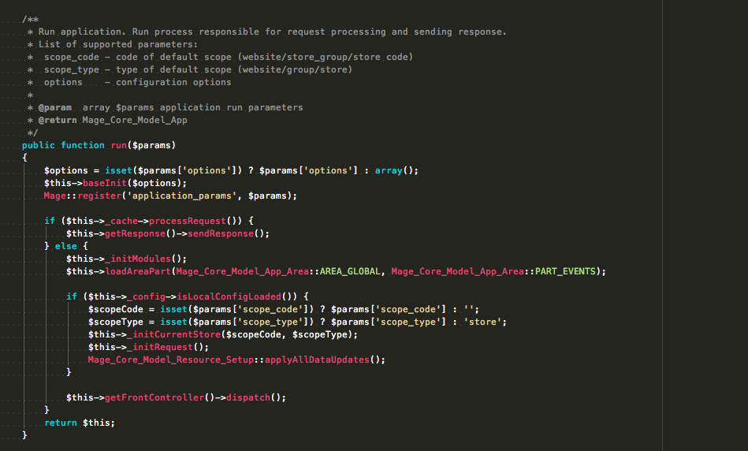

This is a port of the Monokai theme from Sublime Text 2 to PHPStorm. It looks a bit like this:

The main languages should be covered but things like HAML and SASS probably don't have the right colours, yet.

# Installation

Taking my cue from Cameron Eagans' [port of the Solarized theme](https://github.com/cweagans/phpstorm-solarized) for PHP Storm, I'm not going to faff about with .jar files just to distribute a singel XML file. So:

Go to Preferences -> Editor -> Colors and Fonts. Create a new color
scheme called "Monokai Sublime".

Click Apply.

Search your hard drive for a file called "Monokai_Sublime.xml"

Replace that file with the one in this github repository.

On a Mac, you'll find that file at
`~/Library/Preferences/WebIDE10/colors/Monokai_Sublime.xml`

On Linux the file is located at
`~/.WebIde10/config/colors/Monokai_Sublime.xml`

On Windows, the files are located in
`C:\Documents and Settings\<Your username>\.WebIde10\config\colors`

